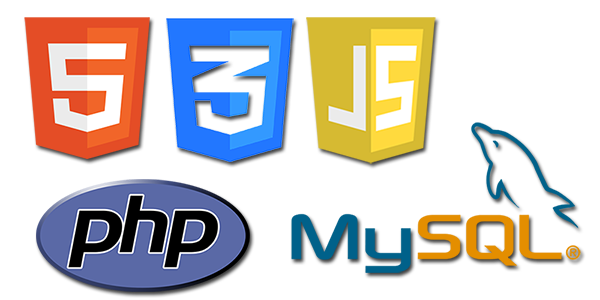
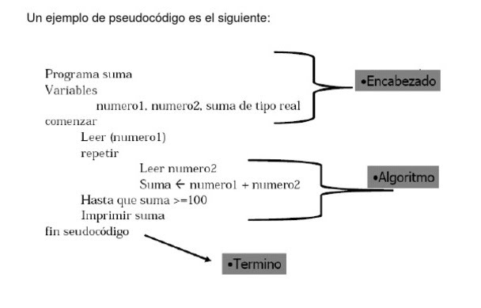

En esta guía hablaremos acerca de los fundamentos de la programación iremos desde lo más básico hasta dominar todo referente a este mundo con un equilibrio de teorías y prácticas esperemos que me puedan acompañar a lo largo de esta serie de posts donde aclararemos las dudas que tiene un programador cuando se inicia, cuáles son los pasos para llegar a ser un buen programador y a dominar la estructura de cualquier lenguaje de programación.


[#](#porque-es-importante) ¿Porque es importante la programación?
----------------------

Muchos nos hacemos esta pregunta antes de entrar al mundo de la programación, hay que tener claro que estamos en tiempos donde la tecnología avanza a pasos agigantados; para centrarnos en la pregunta programar desarrolla nuestra lógica, nos ayuda a pensar de manera más clara, a buscar más de una alternativa para enfrentar una problemática, además que nos hace ser más creativos, innovadores y líderes. De hecho hay muchos proyectos para que de muy niños se pueda aprender el arte de la programación pero para no complicar la vida los niños con los códigos, se les enseña la programación en bloque, los más conocidos son [scratch](https://scratch.mit.edu/) que está desarrollado en el instituto tecnológico de massachusetts y [code](https://code.org/learn) que son más de 100 empresas que colaboran en el proyecto, entre las principales empresas destacan Amazon, Apple, Facebook, Google y Microsoft.

[#](#como-puedo-ser-buen-prog) ¿Cómo puedo ser un buen programador?
----------------------

No existe una guía definitiva pero si hay consejos que te ayudarán a ser mejor programador, elige la tecnología correcta tómate tu tiempo para elegir el lenguaje o la tecnología que más se ajusta a las necesidades de tu proyecto supongamos que quieres desarrollar un blog, para ello necesitas aprender [HTML](https://es.wikipedia.org/wiki/HTML), [CSS](https://es.wikipedia.org/wiki/Hoja_de_estilos_en_cascada), [Javascript](https://es.wikipedia.org/wiki/JavaScript) y [PHP](https://es.wikipedia.org/wiki/PHP) para poder realizarlo, pero de forma más fácil puedes recurrir a un CMS como [Wordpress](https://es.wikipedia.org/wiki/WordPress), [Joomla](https://es.wikipedia.org/wiki/Joomla) o [Drupal](https://es.wikipedia.org/wiki/Drupal) en la cual vas a ahorrar mucho tiempo. También recuerda investigar los pros y los contras de cada tecnología que queremos emplear, siempre leer la documentación del lenguaje o de la tecnología qué estás estudiando ya que a veces no sabemos la funcionalidad con sólo observar videos o leer algún artículo ya que siempre tienden a ser muy cortos y obvian muchas cosas que quizá el autor domina pero quién se toma el tiempo de observar no entiende, por ello es bueno recurrir a la documentación oficial. 



* Empieza por proyectos pequeños así sea una calculadora, proyectos pequeños poco a poco nos enseñarán a ver nuestra evolución de programador recuerda que una persona en la vida primero gatea, después camina y luego corre, no se pueden saltar etapas primordiales y en programación no solo es copiar y pegar códigos de otros sino es entender los pasos que ellos hicieron para resolver dicho problema, recuerda que lo más fácil es copiar y pegar para que funcione el programa pero no te engañes a ti mismo que de esa forma no aprendes nada. 

* Ser parte de comunidades de programación, hablar sobre un desarrollo y debatir sobre el mismo en una comunidad resulta muy favorable porque intercambian diferentes puntos de vistas en los cuales te pueden ayudar a elegir un camino diferente al que tenías pensado y de forma más eficiente, no solo es escribir código también debes escuchar, debatir, pensar y pasar tiempo con compañeros desarrolladores, no tengas miedo de debatir con ellos ya que aprenderás y recuerda que por más que tu idea sea simple o errónea sino debates no te quitarás las dudas. Una comunidad muy grande es estar [Stackoverflow](https://es.wikipedia.org/wiki/Stack_Overflow) donde puedes encontrar cualquier tipo de ayuda y en Facebook también hay grupos de comunidades de programación que te puede ayudar bastante. 

* Nunca dejes de aprender, investigar sobre errores que tienes en tu código te hará un programador con más experiencia pero no solo es investigar soluciones de errores sino aprender cada día más, suponiendo que quiere dominar Javascript tienes que aprender sus fundamentos básicos intermedios y avanzados después de ello quizá ir por [React](https://es.wikipedia.org/wiki/React), [Angular](https://es.wikipedia.org/wiki/Angular_(framework)), [Vue](https://en.wikipedia.org/wiki/Vue.js) o por [Node](https://es.wikipedia.org/wiki/Node.js) en el [backend](https://platzi.com/blog/que-es-frontend-y-backend/). Estudiar en una universidad es importante pero no es un factor clave, lo más importante son los proyectos que realizas, a un programador no lo hace un título que diga que ha estudiado cinco años, sino, los proyectos que tiene en Github.

* Tener un conocimiento de inglés, debido a que la mayor parte de la documentación de los proyectos de las tecnologías está en inglés lo mejor es que te prepares para aprender el idioma comercial a nivel mundial así sea un nivel básico a intermedio, en las comunidades de ayuda cómo Stackoverflow las respuestas están en inglés y las herramientas generalmente están documentadas mayormente en inglés así que lo mejor que puedes hacer es estudiar inglés.


[#](#conceptos-basicos) Conceptos básicos
-----------------------------

### ¿Qué es la lógica?

La lógica es una ciencia formal, que forma parte de la filosofía y de las matemáticas. Se centra en el estudio de los procedimientos válidos y no válidos de pensamiento, es decir, en procesos como la demostración, la inferencia o la deducción, así como en conceptos como las falacias, las paradojas y la verdad.

La programación lógica es un paradigma de programación basado en la lógica de primer orden.
 
 ```
    Todos los hombres son mortales
    Socrates es un hombre
    ------------------------------
    Socrates es mortal
```

Se trata de un tipo de programación declarativa, es decir, no se indica cómo se hacen las cosas, sino qué cosas hacer. A partir de eso, el motor de ejecución decide cómo hacerlo.

### ¿Qué es un programa? 


Es un conjunto de instrucciones que una vez ejecutadas realizarán una o varias tareas en una computadora. Sin programas, estas máquinas no pueden funcionar. Al conjunto general de programas, se le denomina software, que más genéricamente se refiere al equipamiento lógico o soporte lógico de una computadora digital.

El comportamiento de un programa depende del tipo de lenguaje usado para escribirlo. En cualquier caso, casi todos los lenguajes de programación se basan en el mismo principio: el programa consiste en un conjunto de comandos que el equipo debe ejecutar.

El equipo ejecuta los comandos a medida que va leyendo el archivo (de arriba hacia abajo) hasta que alcanza un comando (al que a menudo se hace referencia como un comando ramificado) que ordena al equipo ir a una ubicación específica del programa. En cierto modo, se parece a la búsqueda del tesoro, donde el equipo debe seguir las pistas y ejecutar los comandos hasta alcanzar el final del programa y detenerse.

### ¿Qué es un lenguaje de programación?

Es un idioma artificial diseñado para expresar computaciones que pueden ser llevadas a cabo por máquinas como las computadoras. Pueden usarse para crear programas que controlen el comportamiento físico y lógico de una máquina, para expresar algoritmos con precisión, o como modo de comunicación humana.

Está formado de un conjunto de símbolos y reglas sintácticas y semánticas que definen su estructura y el significado de sus elementos y expresiones. Al proceso por el cual se escribe, se prueba, se depura, se compila y se mantiene el código fuente de un programa informático se le llama programación.

> El número de lenguajes de programación disponible es enorme. Tan solo necesitas abrir un editor de texto especializado en programación para comprobarlo. Cada uno tiene unas características concretas, lo que hace que cada programador deba tener una formación específica en según qué lenguaje utilice.

[#](#metodologia) Metodología de programación 
-----------------------------

### Ciclo del programa


**Fase de planificación.** En esta fase se prepara el diseño y posterior implementación del sistema. Es necesario definir el alcance del proyecto, justificarlo y escoger una metodología para su desarrollo. También es preciso asociar las diferentes actividades a plazos de tiempo y designar roles y responsabilidades.

**Fase de análisis.** Una vez que el equipo de proyecto se decide por una metodología de desarrollo determinada, da comienzo la segunda etapa en el ciclo de vida de un sistema de información. Es la que tiene que ver con el análisis y donde se busca concretar una serie de requisitos, que son los que regirán el nuevo sistema o los cambios a introducir en el antiguo, si con el proyecto se busca su actualización.

**Fase de diseño.** En este estadio el equipo de proyecto tendrá que determinar cómo el nuevo sistema de información cumplirá con los requisitos aplicables. Es por ello que, a estas alturas del ciclo de vida de un sistema de información conviene identificar soluciones potenciales, evaluarlas y elegir la más conveniente. Ésta será o la más efectiva, o la más eficiente en costes o la menos compleja. Una vez completadas esas tareas, habrá que continuar haciendo la selección tecnológica de software y hardware, desarrollando las especificaciones para las distintas aplicaciones y obteniendo aprobación de la gerencia para poder proceder a la implementación del nuevo sistema.

**Fase de desarrollo.** El desarrollo software marca un antes y un después en la vida del sistema y significa, además, el inicio de la producción. El cambio es una constante durante esta etapa, en la que suele ser recomendable poner el foco en la formación y capacitación de los usuarios y el equipo técnico.

**Fase de integración y periodo de pruebas.** El objetivo de esta etapa es corroborar que el diseño propuesto cumple con los requisitos de negocio establecidos. Puede ser necesario repetir las pruebas tantas veces como haga falta para evitar errores y, de hecho, conviene que el usuario final dé su conformidad con el resultado. Por último, este estadio concluye con la verificación y validación, que ayudan a asegurar la compleción del programa con éxito.

**Fase de implementación.** En esta etapa del ciclo de vida de un sistema de información hay que proceder a la instalación del hardware y software elegidos, crear las aplicaciones correspondientes, someterlas a pruebas, crear la documentación pertinente y capacitar a los usuarios. La conversión de datos es importante en este estadio, en el que ya se empieza a trabajar en el nuevo sistema.

**Fase de mantenimiento**. Esta etapa del ciclo de vida de un sistema de información está relacionada con las operaciones del día a día. Por lo general, consiste en introducir los ajustes necesarios para mejorar el rendimiento y corregir los problemas que puedan surgir. Una vez concluye la etapa de implementación se suele abrir un periodo de operación supervisada, durante el que las actividades de mantenimiento cobran una especial importancia, al orientarse a hacer backups, dar soporte a los usuarios, resolver fallos, optimizar el sistema para cuestiones relacionadas con la seguridad o la velocidad y revisar el software para garantizar la alineación >con las metas del negocio.

[#](#algoritmos) Algoritmos
-----------------------------

### ¿Qué es un algoritmo?

Vemos definición de algoritmo como un grupo de órdenes consecutivas que presentan una solución a un problema o tarea. Algunos ejemplos de algoritmos los podemos encontrar en las matemáticas (como el algoritmo para resolver una multiplicación) y en los manuales de usuario de un aparato (como una lavadora o una impresora).

> Un algoritmo informático es una secuencia de instrucciones finitas que llevan a cabo una serie de procesos para dar respuesta a determinados problemas. Es decir, un algoritmo informático resuelve cualquier problema a través de unas instrucciones y reglas concisas, mostrando el resultado obtenido.

### Tipos de algoritmos

* Según su sistema de signos: son aquellos que contienen tanto algoritmos verbales, como computacionales y matemáticos y se pueden distinguir como:
    1. **Cualitativos**. Los que se formulan paso a paso, de forma escrita u oral, como las recetas de cocina, o las instrucciones para llevar a cabo un trabajo de bricolaje, por ejemplo.
    1. **Cuantitativos**. Basados en instrucciones numéricas y creados concretamente para encontrar el resultado de algún cálculo o ecuación. 
 
* Según sus funciones: 
    1. **Ordenación**. Se trata de algoritmos estrictos creados a partir de instrucciones que enumeran los elementos. 
    1. **Búsqueda**. Estos algoritmos se encargan de seleccionar elementos específicos que cumplen con un perfil determinado.
    1. **Encaminamiento**. Sirven para transmitir una información al público, mediante pasos enlazados Están basados en teorías comunicacionales adaptativas y estáticas, como la aguja hipodérmica. 

* Según su estrategia. Se trata de algoritmos técnicos que antes de implementarse definitivamente deben pasar por estudios estratégicos.
    1. **Probabilísticos**. Son aquellos que dependen de hipótesis o probabilidades, por lo que pueden presentar un porcentaje de margen de error. Se conocen también como algoritmos aleatorios y su aplicación no requiere de conocimiento sofisticado o matemático.
    1. **Heurísticos**. Mediante los algoritmos heurísticos se procura dar rápidamente una solución a una alternativa que no la resuelve por vías habituales. Aunque encuentran soluciones entre todas las posibles, no garantizan que la mejor de éstas será encontrada, por lo que son aproximados y carecen de precisión. 
    1. **Deterministas**. Son algoritmos predictivos cuya frecuencia es lineal. Permiten determinar el máximo común divisor entre dos números.
    1. **Estocásticos**. Es aquel tipo de algoritmo cuyo comportamiento no es determinista, por lo que su comportamiento es intrínseco.


### Lenguajes logarítmicos

Es una serie de símbolos y reglas que se utilizan para describir de manera explícita un proceso. Teniendo en cuenta la forma en que describen el proceso, existen dos tipos de lenguajes algorítmicos:

* **Gráficos:** Es la representación gráfica de las operaciones que realiza un algoritmo (diagrama de flujo).


* **No Gráficos:** Representa en forma descriptiva las operaciones que debe realizar un algoritmo (pseudocódigo).


