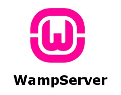

Existen una gran cantidad de lenguajes de programación en la actualidad, cada uno de ellos con un propósito específico. Como programador, es probable que domines algunos de ellos para poder crear proyectos más complejos. Asimismo, estar al tanto de las últimas tecnologías y actualizaciones disponibles para tus lenguajes predilectos.

Sin embargo, para llevar a cabo un proyecto complejo es necesario contar con otro tipo de herramientas que facilitan tu trabajo al automatizar ciertos procesos y simplificar algunas tareas. De esta forma, ahorras tiempo y puedes invertirlo en otras tareas que requieran tu atención.

Existen muchas herramientas y tecnologías que dependiendo del objetivo que quiere alcanzar serán necesarias como editores de código, frameworks, entornos de desarrollo integrado, bases de datos, entornos de desarrollo local, gestores de dependencias, sistemas de control de versiones, entre otros. Con el propósito de simplificar esta guia mencionaremos solo 2 herramientas necesarias para  comenzar.


[#](#WampServer) WampServer
----------------------

El código de las páginas web corren en servidores pero no siempre tendrás acceso a un servidor de hosting, ya sea porque no te han facilitado esos datos o porque el servicio de hosting aún no se ha adquirido. En estos caso, no te queda de otra opción que configurar un servidor local para poder realizar las pruebas y verificar si todo está en orden. Si bien es posible configurar un servidor local de forma manual, existen herramientas que facilitan este proceso por ti, de manera que la instalación y configuración se realizan de forma automática y puedes centrarte en otras tareas. 

WampServer es un entorno de desarrollo para Windows. Es un paquete que instala **Apache2**, **PHP**, **MySQL** y **phpMyAdmin**. Con WampServer tienes control sobre la configuración del servidor local creado y puedes gestionar todos los servicios de Apache y MySQL. Es importante que estas herramientas *(Apache2, PHP, MySQL y phpMyAdmin)* son básicas para  construir un sitio web, WampServer lo que hace es empaquetarlas en un solo programa para que sean sencillas de usar.



**Apache2** es un software de servidor web gratuito y de código abierto para plataformas Unix con el cual se ejecutan el 46% de los sitios web de todo el mundo. [Sitio Web](https://httpd.apache.org/).

**PHP** es un lenguaje de código abierto muy popular especialmente adecuado para el desarrollo web. [Sitio Web](https://www.php.net/). 

**MySQL** es un sistema de administración de bases de datos (Database Management System, DBMS) para bases de datos relacionales. [Sitio Web](https://www.mysql.com/).

**phpMyAdmin** es una herramienta escrita en PHP con la intención de manejar la administración de MySQL a través de páginas web, utilizando un navegador. [Sitio Web](https://www.phpmyadmin.net/).

## Sitio web

[https://www.wampserver.com/](https://www.wampserver.com/en/)

## Instalación

1. Lo primero que vamos a hacer es descargar WAMP, así que accede a la [página oficial de WAMP](https://www.wampserver.com/en/) y haz click en **Download** para ver las versiones de WAMP disponibles.

    

2. Ahora tendrás que seleccionar la versión de WAMP adecuada. Verás una versión de **32 bits (x32)** y otra de **64 bits (x64)**. Deberás descargarte una versión u otra dependiendo de si tu sistema operativo es de 32 o de 64 bits. Si tu ordenador tiene menos de 10 años, seguramente sea de 64 bits.

    * [¿Como Saber si mi pc es de 32 o 64 bits?](https://www.profesionalreview.com/2018/10/29/saber-ordenador-32-64-bits/)

    
    
3. Ahora te tendrás que descargar el instalador. Cuando hagas clic en una de las versiones, verás una series de avisos indicando ciertas incompatibilidades con versiones anteriores de WAMP, además de los requerimientos en tu sistema operativo. Haz clic en **download directly** para descargar el **instalador** de WAMP. Serás redirigido a sourceforge y la descarga comenzará automáticamente.

    
    
4. Una vez te hayas descargado el instalador de WAMP debes ejecutarlo. Localiza el archivo descargado en la carpeta de descargas de tu navegador, que seguramente sea la carpeta de descargas de tu carpeta de usuario o el escritorio, y ejecútalo. Si se muestra un mensaje indicando que debes proporcionar permisos de administrador para ejecutar el instalador, acéptalo.

5. Primero tendrás que seleccionar el idioma de WAMP. Si tu idioma no está en la lista (**el español no lo está por ahora**), selecciona inglés o aquel con el que mejor te defiendas. Haz clic en OK para continuar.

    
    
6. Marca la casilla correspondiente **«I accept the agreement»** para aceptar el acuerdo de licencia de WAMP. Continúa haciendo clic en **Siguiente (Next)**.

    
    
7. Ahora verás un mensaje en el que se indican los **requisitos de WAMP** y aquellos componentes que necesitas tener instalados en tu sistema para que WAMP funcione correctamente. *Básicamente, se especifican las versiones de Microsoft VC++ que debes tener instaladas. Si continuas con la instalación sin instalar estos paquetes podrás finalizar el proceso, pero WAMP no funcionará, puesto que se mostrará un mensaje indicando que faltan ciertos archivos en el sistema. Haz clic en Siguiente (Next) para continuar.* **Usualmente estas librerias vienen isntaladas por defecto en windows 7 en adelante.**

    
    
8. Introduce el nombre del **directorio** en el que quieres instalar WAMP. En este caso hay una particularidad que debes saber. Es más que recomendable instalar WAMP en una carpeta del **directorio raíz** de tu disco duro. El nombre del directorio **no debe contener espacios**. Si instalas WAMP en un subdirectorio, **éste no debe ser el de Archivos de programa** y, además, **ningún directorio de la ruta hasta el directorio de instalación de WAMP debe contener espacios en su nombre**. Clic en Siguiente (Next) para continuar.

    
    
9. Seguidamente, introduce la carpeta del menú de inicio en la que quieres que se creen los accesos directos a WAMP. Haz clic en **Siguiente (Next)** para continuar.

    
    
10. Finalmente, confirma los detalles introducidos y haz clic en **Siguiente (Next)** para continuar. La instalación dará comienzo, pero durante el proceso tendrás que seleccionar el **navegador** que quieres que WAMP use por defecto y el **editor de texto** con el que se abrirán los archivos de configuración de WAMP cuando los selecciones.

11. Si quiere establecer que Chrome se el navegador que WAMP use por defecto, tendrás que seleccionar el archivo ejecutable de Chrome, que se suele encontrar el la ruta **«C:\Archivos de programa (x86)\Google\Chrome\Application»**. Navega hasta este directorio y haz clic en el archivo **chrome.exe** para seleccionarlo. Si no seleccionas ninguno, se utilizará por defecto **Internet Explorer**.

12. El editor de texto que se usará por defecto es el **bloc de notas** de Windows. Para que WAMP abra los archivos de configuración con otro editor, tendrás que navegar hasta la ruta en la que se encuentra el archivo ejecutable del editor y hacer clic en él.

    
    
13. Cuando termine la instalación. verás un mensaje de confirmación. Haz clic en **Finalizar (Finish)** para cerrar el instalador.
    
    Si todo ha ido bien, ya tenemos nuestros servidores instalados y ejecutándose. En la zona de los iconos veremos el icono de WAMP en verde, indicativo de que todo está funcionando correctamente.
    
    
    
14. Ahora, si abrimos nuestro navegador favorito e introducimos la url [http://localhost](http://localhost) deberiamos ver la página principal de WAMP.

    
    
    En la ventana de resumen, nos muestra las versiones de PHP, Mysql y Apache, así cómo las extensiones cargadas por este último. Después tenemos en las herramientas (Tools) la función phpinfo, que nos mostrará toda la información de configuración actual de PHP. También tenemos un enlace a phpmyadmin para poder gestionar MySQL.
    
15. Si no esta encendido. Puedes iniciar WAMP desde el acceso directo del escritorio o desde el menú de inicio. Cuando WAMP se abra se agregará el icono de WAMP en la barra de herramientas del menú de inicio de Windows.
 
    
    
    Este icono podrás mostrarse en varios colores dependiendo del estado de los servicios:

    * Rojo: El icono estará en rojo cuando no esté activo ni Apache ni ningún otro servicio.
    * Verde: El icono estará en verde cuando todos los servicios se estén ejecutando.
    * Naranja: El icono estará en naranja cuando los servicios se estén iniciando.

    Cuando hagas clic en el icono de WAMP podrás ver opciones para iniciar o parar WAMP. También tendrás accesos directos a phpMyAdmin y Adminer, que son aplicaciones con las que podrás gestionar bases de datos MySQL y MariaDB. También podrás crear y configurar hosts virtuales en WAMP y acceder a los archivos de configuración de Apache, de PHP, de MariaDB y de MySQL. Necesitarás dar privilegios de administrador a WAMP para que éste pueda ejecutase. Podrás hacerlo directamente desde el mensaje emergente que se mostrará.

    

    Cuando Apache esté activo, podrás acceder a la página por defecto desde tu navegador en la ruta [http://localhost](http://localhost). Si ves la página de inicio de WAMP Server, querrá decir que Apache y en consecuencia WAMP se está ejecutando correctamente.

## Como ejecutar el código

Vamos a hacer un «Hola Mundo» de la forma más básica posible y sin cambiar nada en la configuración de Apache ni de PHP.

1. Lo primero, vamos a crear el directorio de proyecto. La carpeta a la que Wamp puede acceder para visualizar las webs en el navegador se ubican en un directorio que se conoce con el nombre de «DocumentRoot». Por defecto, está en **«c:/wamp/www»** si fue esa tu ruta de instalación.

    Tambien pueden hacer click en la opcion **www directory** en WAMP, esto te abrira la carpeta con contienen los archivos que corren el el servidor local.

    
    
2. Accedemos a este directorio y dentro creamos el directorio de proyecto, **«holaMundo»**. Dentro, crearemos un nuevo archivo de texto y lo llamaremos index.php. Es muy importante cambiarle la extensión, por defecto .txt, a .php, para que Wamp lo pueda interpretar. Recuerda que nuestro dominio [http://localhost](http://localhost) ahora funciona como un punto de a acceso a esta carpeta por que que si quieres ver el contenido dentro de la carpeta recién creada debes ir a [http://localhost/holaMundo](http://localhost/holaMundo).

3. En este punto aún no encontrarás nada que ver dado que el archivo index.php que debiste crear en el punto anterior está vacío por lo que debes abrir el archivo con el editor de texto que tengas en la computadora y escribir lo siguiente.

    ```php
    <html>
     <head>
      <title>Prueba de PHP</title>
     </head>
     <body>
         <?php echo '<p>Hola Mundo</p>'; ?>
     </body>
    </html>
    ```


4. Debes ir a [http://localhost/holaMundo](http://localhost/holaMundo), lo siguiente que pasara dejare que los descubras por cuenta propia.

[#](#Visual-Studio-Code) Visual Studio Code
----------------------

Si bien es posible comenzar a crear código en un ordenador simplemente con un bloc de notas, realmente no es muy recomendable. Mientras mayor contenido tenga tu archivo existen mayores posibilidades de cometer errores y puede ser bastante complicado detectar y depurar errores en un archivo TXT del bloc de notas. Para facilitar tareas posteriores es mejor optar por un editor de código que posee una interfaz diseñada para trabajar sin distracciones y diversas características que facilitan el proceso de desarrollo web y programación.

Visual Studio Code es compatible con diversos lenguajes. Posee una interfaz intuitiva y con un gran diseño que se puede personalizar, tanto a nivel de aspecto como de funcionalidad al instalar algunas de las extensiones que pone a tu disposición la comunidad de Visual Studio Code. Puedes buscar e instalar extensiones desde la propia interfaz del programa.


## Sitio web

[https://code.visualstudio.com/](https://code.visualstudio.com/)

## Instalación

1. Lo primero que vamos a hacer es descargar Visual Studio Code, así que accede a la [página oficial de VSC](https://code.visualstudio.com/) y haz click en **Download for windows** lo que iniciará la descarga.

    

2. Hacer doble click en el instalador y dar permisos de administrador de ser necesario.

    
    
3. Seguir el wizard de la misma forma en la que instalas todos los programas.

    
    
    Hasta llegar a finalizar.
    
    
    
4. Al finalizar el programa se debería ejecutar, ya puedes empezar a editar archivos.


